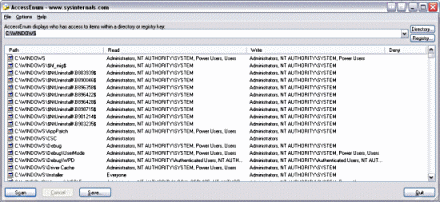

--- 
TOCTitle: AccessEnum
title: AccessEnum
description: This simple yet powerful security tool shows you who has what access to directories, files and Registry keys on your systems.
ms:assetid: 'dd3ac121-4a4b-48b4-98a7-8b0dfeda3007'
ms:mtpsurl: 'https://technet.microsoft.com/Bb897332(v=MSDN.10)'
ms.date: 11/01/2006
---   
AccessEnum v1.32
================
**By Mark Russinovich**

Published: November 1, 2006

  [**Download AccessEnum**](https://download.sysinternals.com/files/AccessEnum.zip) **(51 KB)**  
**Run now** from [Sysinternals Live](https://live.sysinternals.com/AccessEnum.exe).

## Introduction
While the flexible security model employed by Windows NT-based systems allows full control over security and file permissions, managing permissions so that users have appropriate access to files, directories and Registry keys can be difficult. There's no built-in way to quickly view user accesses to a tree of directories or keys. *AccessEnum* gives you a full view of your file system and Registry security settings in seconds, making it the ideal tool for helping you find security holes and lock down permissions where necessary.

## How It Works
*AccessEnum* uses standard Windows security APIs to populate its listview with read, write and deny access information.

  [**Download AccessEnum**](https://download.sysinternals.com/files/AccessEnum.zip) **(51 KB)**  

**Run now** from [Sysinternals Live](https://live.sysinternals.com/AccessEnum.exe).
