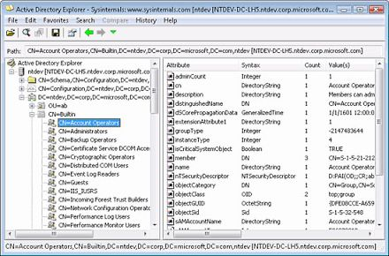

--- 
TOCTitle: AD Explorer
title: AD Explorer
description: Active Directory Explorer is an advanced Active Directory (AD) viewer and editor.
ms:assetid: 'da300ae9-b58f-4acc-a169-ce3b39867bc8'
ms:mtpsurl: 'https://technet.microsoft.com/Bb963907(v=MSDN.10)'
ms.date: 12/15/2021
---

# Active Directory Explorer v1.51

**By Mark Russinovich**

Published: December 15, 2021

  [**Download AdExplorer**](https://download.sysinternals.com/files/AdExplorer.zip) **(1.2 MB)**  
**Run now** from [Sysinternals Live](https://live.sysinternals.com/ADExplorer.exe).

## Introduction

Active Directory Explorer (AD Explorer) is an advanced Active Directory
(AD) viewer and editor. You can use AD Explorer to easily navigate an AD
database, define favorite locations, view object properties and
attributes without having to open dialog boxes, edit permissions, view
an object's schema, and execute sophisticated searches that you can save
and re-execute.

AD Explorer also includes the ability to save snapshots of an AD
database for off-line viewing and comparisons. When you load a saved
snapshot, you can navigate and explore it as you would a live database.
If you have two snapshots of an AD database you can use AD Explorer's
comparison functionality to see what objects, attributes and security
permissions changed between them.

  [**Download AdExplorer**](https://download.sysinternals.com/files/AdExplorer.zip) **(1.2 MB)**

**Run now** from [Sysinternals Live](https://live.sysinternals.com/ADExplorer.exe).
