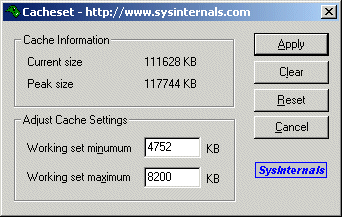

# CacheSet v1.0

**By Mark Russinovich**

Published: November 1, 2006

 [**Download CacheSet**](https://download.sysinternals.com/files/CacheSet.zip) **(44 KB)**
**Run now** from [Sysinternals Live](https://live.sysinternals.com/Cacheset.exe).

## Introduction

*CacheSet* is an applet that allows you to manipulate the working-set
parameters of the system file cache. Unlike CacheMan, *CacheSet* runs on
all versions of NT and will work without modifications on new Service
Pack releases. In addition to providing you the ability to control the
minimum and maximum working set sizes, it also allows you to reset the
Cache's working set, forcing it to grow as necessary from a minimal
starting point. Also unlike CacheMan, changes made with *CacheSet* have
an immediate effect on the size of the Cache.

Use *CacheSet* to performance tune the system Cache size in a way not
possible without tweaking internal variables the way CacheMan does.

Note: To use *CacheSet* on NT 4.0 Service Pack 4 and later you must have
the "Increase Quota" privilege (administrator accounts have this
privilege by default). *CacheSet* has been updated to enable this
privilege so that it works on SP4.

## Installation and Use

After it starts it presents the system file cache's current size
(updated twice a second), it's peak size (the largest it's been since
the last reboot), and lets you set new minimum and maximum working set
sizes.

**Setting New Sizes**
Simply enter the new minimum and maximum sizes and hit the Apply button.
If you get an error, then one of the following conditions holds: you've
entered a maximum that is smaller than the minimum, the minimum you've
entered is smaller than the minimum system working-set size, or the
maximum you've entered is larger than the maximum system working-set
sizes. Adjust the values you've entered and try again.

You may notice that the Cache's size changes immediately and then
proceeds to shrink or grow quickly. This is because the system
automatically trims working sets once a second. The Cache pages that are
released are still in memory, but can be relinquished quickly for use by
other programs that need more memory. Similarly, the Cache can eaily
regain pages as applications access file system data.

**Resetting Previous Values**
At any time you can restore the Cache's working set values that were
active when you last started *CacheSet* by hitting the Reset button.

**Clearing the Cache's Working Set**
You can force the Cache to release all of it's pages by pressing the
Clear button. Note that the Cache can grow again as necessary, and that
this is not the same as flushing the Cache - pages that were assigned to
it are simply made available to other programs and can be reclaimed by
the Cache.

**Using the Command-Line Interface**
You can enter the minimum and maximum working set sizes on *CacheSet*'s
command line. *CacheSet* will apply these new values silently. Thus, you
can add *CacheSet* to your Start program group to automatically set the
Cache's sizes every time you boot.

**Usage: CacheSet \[minimum working set\] \[maximum working set\]**

## How It Works

*CacheSet* uses a **NtQuerySystemInformation** call to obtain
information about the Cache's settings and **NtSetSystemInformation** to
set new sizing information. The working-set information for a process
serves as guidelines for NT's Memory Manager regarding how many pages of
physical memory should be assigned to the application. Because they are
guidelines, conditions can result such that the Memory Manager grows a
working-set to a size greater than the maximum, or shrinks it to less
than the minimum. However, the settings are factors that will affect the
overall allocation, and hence responsiveness, of an application. In the
case of *CacheSet* the application is the file system Cache.

Internally **NtSetSystemInformation** calls **MmAdjustWorkingSetSize**,
which either grows an application's working set or trims it. If the
third parameter passed to **MmAdjustWorkingSetSize** is 1, the system
Cache's working set is adjusted, otherwise the adjustment occurs on the
current process (the system information calls affect only the system
cache). Passing in a minimum and maximum of -1 causes
**MmAjustWorkingSetSize** to perform a working-set clear operation,
releasing all pages from the application's working set.

 [**Download CacheSet**](https://download.sysinternals.com/files/CacheSet.zip) **(44 KB)**

**Run now** from [Sysinternals Live](https://live.sysinternals.com/Cacheset.exe).

**Runs on:**

- Client: Windows Vista and higher.
- Server: Windows Server 2008 and higher.
