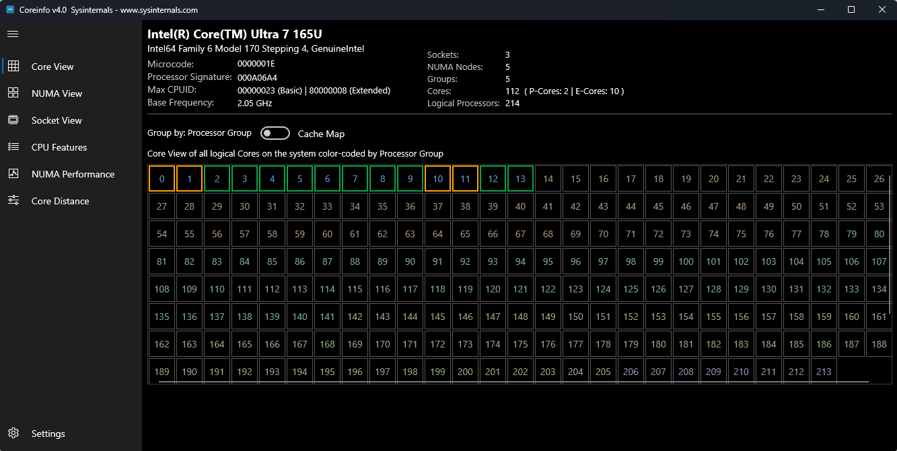
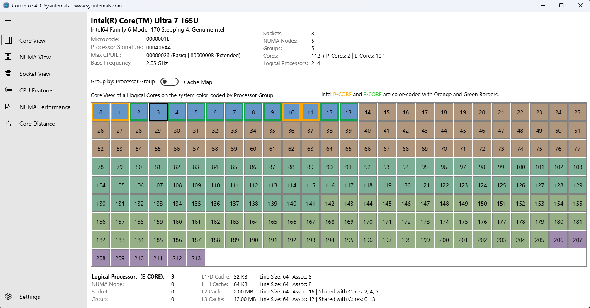
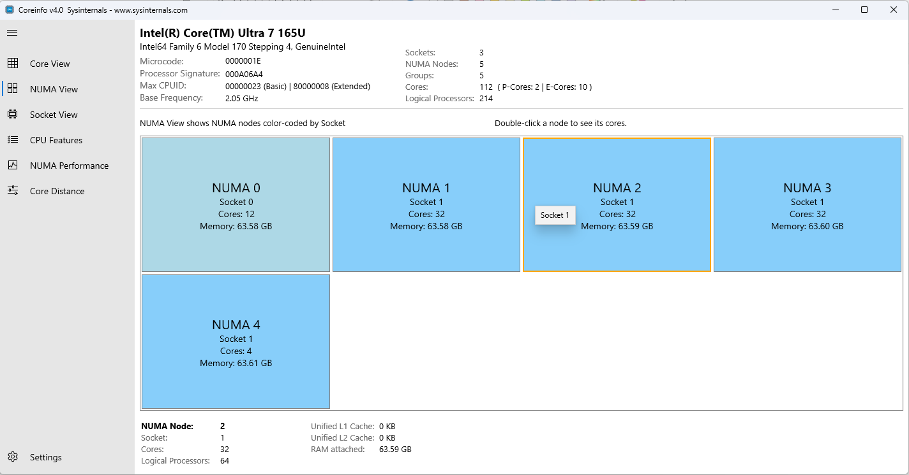
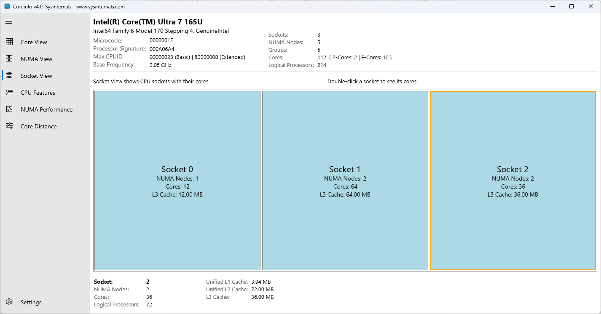
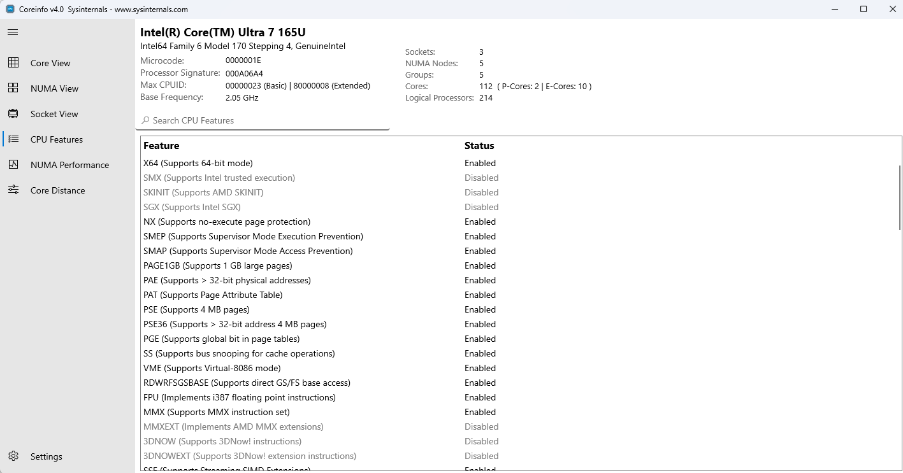
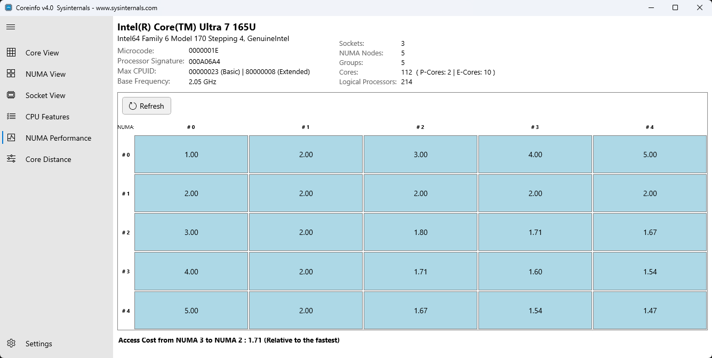
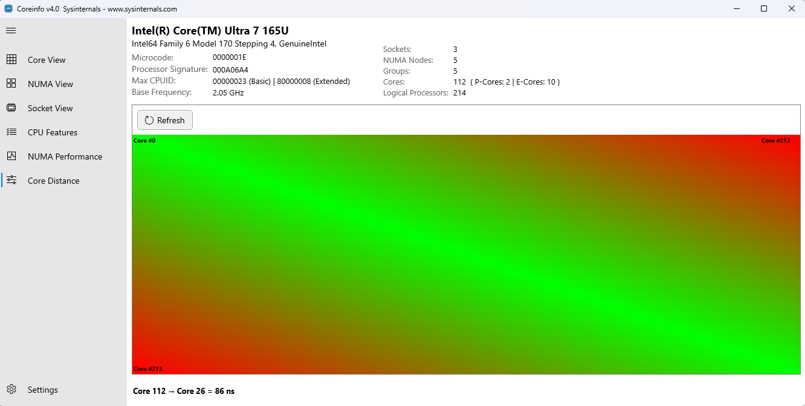

--- 
TOCTitle: Coreinfo
title: Coreinfo
description: Coreinfo is a command-line utility that shows you the mapping between logical processors and the physical processor.
ms:assetid: 'c5e117b5-d674-4409-914d-17bcac43f1fd'
ms:mtpsurl: 'https://technet.microsoft.com/Cc835722(v=MSDN.10)'
ms.date: 12/16/2025
---
# Coreinfo v4.0

**By Mark Russinovich**

Published: December 16, 2025

[](https://download.sysinternals.com/files/Coreinfo.zip) [**Download Coreinfo**](https://download.sysinternals.com/files/Coreinfo.zip) **(531 KB)**

## Introduction

Coreinfo is a utility that shows you the mapping between logical processors and the physical processor, NUMA node, and socket on which they reside, as well as the cache's assigned to each logical processor. It uses low-level Windows APIs (user mode and kernel mode) to retrieve detailed CPU topology information directly from the operating system. The command-line version outputs the representation of the mapping to a logical processor with an asterisk e.g. '`*`'. The UI provides multiple specialized views to explore different aspects of your system's CPU topology, including logical and physical cores, NUMA nodes, sockets, cache hierarchies, and real-time performance metrics. Coreinfo is useful for gaining insight into the processor and cache topology of the system.

## Installation

Extract the archive to a directory and then run Coreinfo by typing from that directory `Coreinfo` / `Coreinfo64` or `Coreinfo64a`, depending on the architecture. Launch `CoreInfoEx` / `CoreInfoEx64` / `CoreInfoEx64a` for the UI version.

**Note:** Some features may require administrative privileges for complete information retrieval.

## User Interface Overview

The Coreinfo UI consists of several key components:

### Main Window Layout

- **Top Panel**: Displays system information including CPU name, architecture, and core counts
- **Navigation Pane** (Left): Provides quick access to different views
- **Content Area** (Center): Shows the selected view's data and visualizations
- **Details Pane** (Bottom): Displays detailed information when cores or cells are selected
- **Settings**: Access appearance options and application preferences


*Main window showing the complete UI layout, dark mode*

---

## Navigation Views

The left navigation pane provides access to six specialized views:

### 1. Core View

The Core View displays all logical processors in your system in a grid layout, showing the relationship between logical cores and their physical resources.

**Features:**

- **Grid Layout**: Each cell represents a logical processor
- **Core Type Indicators**:
  - P-Cores (Performance cores) - colored distinctly
  - E-Cores (Efficiency cores) - colored differently
  - Standard cores - default coloring
- **Cache Mapping Toggle**: Switch between default view and cache hierarchy view
- **Interactive Selection**: Click any core to view detailed information in the bottom pane

**Displayed Information:**

- Logical processor number
- Core type (P-Core/E-Core if applicable)
- Associated cache levels (L1, L2, L3)
- NUMA node assignment
- Socket assignment
- Group assignment


*Core View showing logical processors in grid layout*

**Details Pane Information** (when a core is selected):

- Processor mask and affinity
- Cache hierarchy (Data Cache, Instruction Cache, Unified Cache)
- Cache sizes and associativity
- Cache line sizes

---

### 2. NUMA View

The NUMA (Non-Uniform Memory Access) View organizes cores by their NUMA node assignments, making it easy to understand memory locality and access patterns.

**Features:**

- **Node-Based Organization**: Cores grouped by NUMA node
- **Physical vs Logical Cores**: Shows both counts for each node
- **Memory Information**: Displays available memory per NUMA node
- **Interactive Navigation**:
  - Single-click on a NUMA node to display its details in the bottom details pane
  - Double-click on a NUMA node to navigate to the Core View showing all cores from that selected NUMA node
- **Hierarchical Display**: Shows the relationship between NUMA nodes and cores

**Displayed Information:**

- Number of NUMA nodes
- Cores per NUMA node (physical and logical)
- Memory capacity per node
- Core distribution across nodes
- Efficiency core count (if applicable)


*NUMA View showing cores organized by NUMA nodes*

**Use Cases:**

- Optimizing memory access patterns
- Understanding NUMA-aware application performance
- Planning thread/process placement for optimal performance

---

### 3. Socket View

The Socket View displays cores organized by their physical CPU socket, useful for understanding multi-socket systems and socket-level resource distribution.

**Features:**

- **Socket-Based Grouping**: Cores organized by physical socket
- **Socket Information**: Socket count and core distribution
- **Interactive Navigation**:
  - Single-click on a socket to display its details in the bottom details pane
  - Double-click on a socket to navigate to the Core View showing all cores from that selected socket
- **Cache Sharing**: Visualize which cores share socket-level caches

**Displayed Information:**

- Number of physical sockets
- Cores per socket (physical and logical)
- Socket-level cache information
- NUMA nodes per socket


*Socket View showing cores organized by CPU sockets*

**Use Cases:**

- Multi-socket system analysis
- Understanding cross-socket communication costs
- Planning workload distribution in multi-socket servers

---

### 4. CPU Features View

The CPU Features View displays a comprehensive list of processor capabilities, instruction set extensions, and hardware features supported by your CPU.

**Features:**

- **Searchable List**: Quickly find specific CPU features using the search bar
- **Status Indicators**: Clear visual indication of supported/unsupported features using color coding
  - Supported features are displayed in normal color
  - Unsupported/disabled features are grayed out
- **Feature Categories**:
  - Virtualization (VMX, SVM, HYPERVISOR)
  - 64-bit support (EM64T, NX)
  - Instruction Sets (SSE, AVX, AES, etc.)
  - Power Management (EIST, ACPI, Thermal)
  - Security features (SMX, SKINIT)
  - Memory features (PAE, PAT, PSE)
  - Debug and monitoring features

**Displayed Information:**

- Feature abbreviation
- Feature status (supported/not supported)
- Full feature description (in details pane)


*CPU Features View showing the list of processor capabilities*

**Note:** Some virtualization features (such as VMX, SVM) can be incorrectly reported as not available when running with a hypervisor active, or when running from within a virtual machine. Coreinfo must be executed on a system without a hypervisor running for accurate results.

**Use Cases:**

- Verifying instruction set availability before deploying applications
- Checking virtualization support
- Understanding processor generation and capabilities
- Debugging performance issues related to missing CPU features

---

### 5. NUMA Performance View

The NUMA Performance View provides a grid visualization showing memory access costs between NUMA nodes, helping identify performance bottlenecks in NUMA systems.

**Features:**

- **Grid Visualization**: Matrix displaying relative memory access costs between NUMA nodes
- **Interactive Matrix**: Hover over cells to see detailed performance information
- **Real-Time Updates**: Performance data updates dynamically by selecting the Refresh button
- **Relative Cost Display**: Shows the relative cost of accessing memory from different NUMA nodes

**Displayed Information:**

- NxN matrix where N = number of NUMA nodes
- Memory access cost from source NUMA node (row) to destination NUMA node (column)
- Numerical values showing relative performance costs
- Diagonal cells show local memory access (typically lowest cost)


*NUMA Performance grid showing memory access costs*

**Understanding the Grid:**

- **Diagonal elements**: Represent local memory access (node accessing its own memory) - typically the lowest values
- **Off-diagonal elements**: Represent remote memory access with higher relative costs
- **Symmetry**: The matrix may not be perfectly symmetrical as access costs can vary by direction

**Use Cases:**

- Identifying NUMA-related performance bottlenecks
- Optimizing memory allocation strategies
- Planning process/thread pinning for NUMA systems
- Understanding cross-node memory access penalties

---

### 6. Core Distance View

The Core Distance View displays a detailed heat map of the communication costs between individual CPU cores, providing insights into core-to-core latency and communication efficiency.

**Features:**

- **Core-Level Heat Map**: Color-coded matrix showing relative distances between cores
  - Green/Blue = Low latency (same core cluster, shared cache)
  - Yellow/Orange = Medium latency (same socket, different cluster)
  - Red = High latency (different socket or NUMA node)
- **Interactive Exploration**: Hover on the grid canvas to view detailed distance information
- **Granular Analysis**: Shows core-to-core relationships at the finest granularity
- **Dynamic Refresh**: Use the Refresh button to dynamically obtain updated core distance data

**Displayed Information:**

- NxN matrix where N = number of logical processors
- Relative distance/latency from source core (row) to destination core (column)
- Color coding for quick visual identification of core relationships
- Detailed distance metrics in the details pane


*Core Distance heat map showing core-to-core communication costs*

**Understanding the Distance Map:**

- **Diagonal elements**: Always zero (core to itself)
- **Low distance (green)**: Cores share L2 or L3 cache
- **Medium distance (yellow)**: Cores on same socket but different cache domains
- **High distance (red)**: Cores on different sockets or NUMA nodes

**Use Cases:**

- Thread affinity optimization
- Understanding cache coherency domains
- Identifying optimal core pairs for communicating threads
- Analyzing multi-threaded application performance
- Planning CPU pinning strategies for low-latency applications

---

## Interactive Features

### Core Selection and Details

Clicking on a core in any view (Core, NUMA, or Socket) displays detailed information in the bottom details pane:

- **Processor Information**: Logical processor number, mask, and affinity
- **Cache Hierarchy**:
  - L1 Data Cache (size, associativity, line size)
  - L1 Instruction Cache (size, associativity, line size)
  - L2 Cache (size, associativity, line size)
  - L3 Cache (size, associativity, line size)
- **Topology Information**: NUMA node, socket, and group assignments
- **Core Type**: P-Core, E-Core, or standard core designation

### Search Functionality

The CPU Features view includes a search bar that allows you to quickly locate specific processor features:

1. Click the search icon
2. Type the feature name or abbreviation
3. The list automatically filters to show matching features
4. Clear the search to restore the full list

### Cache Map Toggle

In Core View, toggle between two visualization modes:

- **Default Mode**: Shows cores in their logical arrangement
- **Cache Map Mode**: Reorganizes cores to visualize cache sharing relationships

### Navigation Between Views

- Use the left navigation pane to switch between views
- When viewing a specific NUMA node or socket, clicking the same view again returns to the overall view
- The current view is highlighted in the navigation pane

---

## Settings and Customization

Access settings through the Settings option in the navigation menu.

### Appearance Settings

**Theme Options:**

- **Light**: Light color scheme optimized for bright environments
- **Dark**: Dark color scheme to reduce eye strain
- **System Default**: Automatically matches your Windows theme preference

### Save To File

**Export Core Topology Data:**

- Use the **Save To** option to dump core topology data to a file
- The output format is identical to the command-line tool output

---

## Understanding Your System Topology

### Core Types (Hybrid Architecture)

Modern CPUs may feature hybrid architectures with different core types:

- **P-Cores (Performance)**: High-performance cores optimized for single-threaded and demanding workloads
- **E-Cores (Efficiency)**: Energy-efficient cores optimized for background tasks and multi-threaded workloads

Coreinfo UI clearly identifies and differentiates these core types in all applicable views.

### NUMA Architecture

**What is NUMA?**
Non-Uniform Memory Access (NUMA) is a memory design where each processor has local memory that it can access quickly, and remote memory that requires inter-processor communication.

**Why it matters:**

- Local memory access is significantly faster than remote access
- Application performance can be dramatically affected by NUMA placement
- Understanding NUMA topology is critical for high-performance computing

**Using Coreinfo UI for NUMA Optimization:**

1. Use **NUMA View** to understand your system's NUMA topology
2. Check **NUMA Performance View** to see memory access costs
3. Optimize thread/process placement based on NUMA node assignments
4. Use **Core Distance View** to understand core-to-core communication within and across NUMA nodes

### Cache Hierarchy

**Cache Levels:**

- **L1 Cache**: Smallest and fastest, split into data and instruction caches
- **L2 Cache**: Larger unified cache, typically private to each core
- **L3 Cache**: Largest unified cache, often shared among multiple cores

**Using Cache Information:**

- Understand which cores share cache resources
- Optimize data locality for cache-sharing cores
- Use Cache Map mode in Core View to visualize cache domains

---

## Using Coreinfo from the command-line

For each resource it shows a map of the OS-visible processors
that correspond to the specified resources, with '*' representing the
applicable processors. For example, on a 4-core system, a line in the
cache output with a map of shared by cores 3 and 4.

**Usage:**

```cmd
coreinfo [-c][-f][-g][-l][-n][-s][-m][-v]
```

| Parameter | Description                                                                                                                                          |
|-----------|------------------------------------------------------------------------------------------------------------------------------------------------------|
| **-c**    | Dump information on cores.                                                                                                                           |
| **-f**    | Dump core feature information.                                                                                                                       |
| **-g**    | Dump information on groups.                                                                                                                          |
| **-l**    | Dump information on caches.                                                                                                                          |
| **-n**    | Dump information on NUMA nodes.                                                                                                                      |
| **-s**    | Dump information on sockets.                                                                                                                         |
| **-m**    | Dump NUMA access cost.                                                                                                                               |
| **-v**    | Dump only virtualization-related features including support for second level address translation. (requires administrative rights on Intel systems). |

All options except `-v` are selected by default.

**Coreinfo Output:**

```txt
Coreinfo v4.0 - Dump information on system CPU and memory topology
Copyright © 2008-2025 Mark Russinovich
Sysinternals - www.sysinternals.com

Intel(R) Core(TM) Ultra 7 165U
Intel64 Family 6 Model 170 Stepping 4, GenuineIntel

Microcode signature: 0000001E
Processor signature: 000A06A4

Maximum implemented CPUID leaves: 00000023 (Basic), 80000008 (Extended).
Maximum implemented address width: 48 bits (virtual), 46 bits (physical).

HTT             *       Hyperthreading enabled
CET             *       Supports Control Flow Enforcement Technology
Kernel CET      -       Kernel-mode CET Enabled
User CET        *       User-mode CET Allowed

X64             *       Supports 64-bit mode
SMX             -       Supports Intel trusted execution
SKINIT          -       Supports AMD SKINIT
SGX             -       Supports Intel SGX
NX              *       Supports no-execute page protection
SMEP            *       Supports Supervisor Mode Execution Prevention
SMAP            *       Supports Supervisor Mode Access Prevention
PAGE1GB         *       Supports 1 GB large pages
PAE             *       Supports > 32-bit physical addresses
PAT             *       Supports Page Attribute Table
PSE             *       Supports 4 MB pages
PSE36           *       Supports > 32-bit address 4 MB pages
PGE             *       Supports global bit in page tables
SS              *       Supports bus snooping for cache operations
VME             *       Supports Virtual-8086 mode
RDWRFSGSBASE    *       Supports direct GS/FS base access
FPU             *       Implements i387 floating point instructions
MMX             *       Supports MMX instruction set
MMXEXT          -       Implements AMD MMX extensions
3DNOW           -       Supports 3DNow! instructions
3DNOWEXT        -       Supports 3DNow! extension instructions
SSE             *       Supports Streaming SIMD Extensions
SSE2            *       Supports Streaming SIMD Extensions 2
SSE3            *       Supports Streaming SIMD Extensions 3
SSSE3           *       Supports Supplemental SIMD Extensions 3
SSE4a           -       Supports Streaming SIMDR Extensions 4a
SSE4.1          *       Supports Streaming SIMD Extensions 4.1
SSE4.2          *       Supports Streaming SIMD Extensions 4.2
AES             *       Supports AES extensions
AVX             *       Supports AVX instruction extensions
AVX2            *       Supports AVX2 instruction extensions
AVX-512-F       -       Supports AVX-512 Foundation instructions
AVX-512-DQ      -       Supports AVX-512 double and quadword instructions
AVX-512-IFAMA   -       Supports AVX-512 integer Fused multiply-add instructions
AVX-512-PF      -       Supports AVX-512 prefetch instructions
AVX-512-ER      -       Supports AVX-512 exponential and reciprocal instructions
AVX-512-CD      -       Supports AVX-512 conflict detection instructions
AVX-512-BW      -       Supports AVX-512 byte and word instructions
AVX-512-VL      -       Supports AVX-512 vector length instructions
FMA             *       Supports FMA extensions using YMM state
MSR             *       Implements RDMSR/WRMSR instructions
MTRR            *       Supports Memory Type Range Registers
XSAVE           *       Supports XSAVE/XRSTOR instructions
OSXSAVE         *       Supports XSETBV/XGETBV instructions
RDRAND          *       Supports RDRAND instruction
RDSEED          *       Supports RDSEED instruction
CMOV            *       Supports CMOVcc instruction
CLFSH           *       Supports CLFLUSH instruction
CX8             *       Supports compare and exchange 8-byte instructions
CX16            *       Supports CMPXCHG16B instruction
BMI1            *       Supports bit manipulation extensions 1
BMI2            *       Supports bit manipulation extensions 2
ADX             *       Supports ADCX/ADOX instructions
DCA             -       Supports prefetch from memory-mapped device
F16C            *       Supports half-precision instruction
FXSR            *       Supports FXSAVE/FXSTOR instructions
FFXSR           -       Supports optimized FXSAVE/FSRSTOR instruction
MONITOR         *       Supports MONITOR and MWAIT instructions
MOVBE           *       Supports MOVBE instruction
ERMSB           *       Supports Enhanced REP MOVSB/STOSB
PCLMULDQ        *       Supports PCLMULDQ instruction
POPCNT          *       Supports POPCNT instruction
LZCNT           *       Supports LZCNT instruction
SEP             *       Supports fast system call instructions
LAHF-SAHF       *       Supports LAHF/SAHF instructions in 64-bit mode
HLE             -       Supports Hardware Lock Elision instructions
RTM             -       Supports Restricted Transactional Memory instructions
DE              *       Supports I/O breakpoints including CR4.DE
DTES64          -       Can write history of 64-bit branch addresses
DS              -       Implements memory-resident debug buffer
DS-CPL          -       Supports Debug Store feature with CPL
PCID            *       Supports PCIDs and settable CR4.PCIDE
INVPCID         *       Supports INVPCID instruction
PDCM            *       Supports Performance Capabilities MSR
RDTSCP          *       Supports RDTSCP instruction
TSC             *       Supports RDTSC instruction
TSC-DEADLINE    *       Local APIC supports one-shot deadline timer
TSC-INVARIANT   *       TSC runs at constant rate
xTPR            *       Supports disabling task priority messages
EIST            *       Supports Enhanced Intel Speedstep
ACPI            *       Implements MSR for power management
TM              *       Implements thermal monitor circuitry
TM2             *       Implements Thermal Monitor 2 control
APIC            *       Implements software-accessible local APIC
x2APIC          *       Supports x2APIC
CNXT-ID         -       L1 data cache mode adaptive or BIOS
MCE             *       Supports Machine Check, INT18 and CR4.MCE
MCA             *       Implements Machine Check Architecture
PBE             *       Supports use of FERR#/PBE# pin
PSN             -       Implements 96-bit processor serial number
HTT             *       Hyperthreading
PREFETCHW       *       PrefetchW instruction support
HYPERVISOR      *       Hypervisor is present
VMX             -       Supports Intel hardware-assisted virtualization
EPT             -       Supports Intel extended page tables (SLAT)
URG             -       Supports Intel unrestricted guest

Logical to Physical Processor Map:
**------------  Physical Processor 0 (Hyperthreaded)
--*-----------  Physical Processor 1
---*----------  Physical Processor 2
----*---------  Physical Processor 3
-----*--------  Physical Processor 4
------*-------  Physical Processor 5
-------*------  Physical Processor 6
--------*-----  Physical Processor 7
---------*----  Physical Processor 8
----------**--  Physical Processor 9 (Hyperthreaded)
------------*-  Physical Processor 10
-------------*  Physical Processor 11

Logical Processor to Socket Map:
**************  Socket 0

Logical Processor to NUMA Node Map:
**************  NUMA Node 0

No NUMA nodes.

Logical Processor to Cache Map:
**------------  Data Cache          0, Level 1,   48 KB, Assoc  12, LineSize  64
**------------  Instruction Cache   0, Level 1,   64 KB, Assoc  16, LineSize  64
**------------  Unified Cache       0, Level 2,    2 MB, Assoc  16, LineSize  64
************--  Unified Cache       1, Level 3,   12 MB, Assoc  12, LineSize  64
--*-----------  Data Cache          1, Level 1,   32 KB, Assoc   8, LineSize  64
--*-----------  Instruction Cache   1, Level 1,   64 KB, Assoc   8, LineSize  64
--****--------  Unified Cache       2, Level 2,    2 MB, Assoc  16, LineSize  64
---*----------  Data Cache          2, Level 1,   32 KB, Assoc   8, LineSize  64
---*----------  Instruction Cache   2, Level 1,   64 KB, Assoc   8, LineSize  64
----*---------  Data Cache          3, Level 1,   32 KB, Assoc   8, LineSize  64
----*---------  Instruction Cache   3, Level 1,   64 KB, Assoc   8, LineSize  64
-----*--------  Data Cache          4, Level 1,   32 KB, Assoc   8, LineSize  64
-----*--------  Instruction Cache   4, Level 1,   64 KB, Assoc   8, LineSize  64
------*-------  Data Cache          5, Level 1,   32 KB, Assoc   8, LineSize  64
------*-------  Instruction Cache   5, Level 1,   64 KB, Assoc   8, LineSize  64
------****----  Unified Cache       3, Level 2,    2 MB, Assoc  16, LineSize  64
-------*------  Data Cache          6, Level 1,   32 KB, Assoc   8, LineSize  64
-------*------  Instruction Cache   6, Level 1,   64 KB, Assoc   8, LineSize  64
--------*-----  Data Cache          7, Level 1,   32 KB, Assoc   8, LineSize  64
--------*-----  Instruction Cache   7, Level 1,   64 KB, Assoc   8, LineSize  64
---------*----  Data Cache          8, Level 1,   32 KB, Assoc   8, LineSize  64
---------*----  Instruction Cache   8, Level 1,   64 KB, Assoc   8, LineSize  64
----------**--  Data Cache          9, Level 1,   48 KB, Assoc  12, LineSize  64
----------**--  Instruction Cache   9, Level 1,   64 KB, Assoc  16, LineSize  64
----------**--  Unified Cache       4, Level 2,    2 MB, Assoc  16, LineSize  64
------------*-  Data Cache         10, Level 1,   32 KB, Assoc   8, LineSize  64
------------*-  Instruction Cache  10, Level 1,   64 KB, Assoc   8, LineSize  64
------------**  Unified Cache       5, Level 2,    2 MB, Assoc  16, LineSize  64
-------------*  Data Cache         11, Level 1,   32 KB, Assoc   8, LineSize  64
-------------*  Instruction Cache  11, Level 1,   64 KB, Assoc   8, LineSize  64

Logical Processor to Group Map:
**************  Group 0
```

[](https://download.sysinternals.com/files/Coreinfo.zip) [**Download Coreinfo**](https://download.sysinternals.com/files/Coreinfo.zip) **(531 KB)**
**Run now** from [Sysinternals Live](https://live.sysinternals.com/CoreinfoEx.exe).

**Runs on:**

- Client: Windows 11 and higher.
- Server: Windows Server 2016 and higher.
