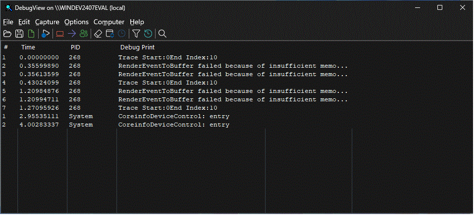

# DebugView v5.01

**By Mark Russinovich**

Published: May 6, 2026

 [**Download DebugView**](https://download.sysinternals.com/files/DebugView.zip) **(1012 KB)**  
**Run now** from [Sysinternals Live](https://live.sysinternals.com/Dbgview.exe).

## Introduction

*DebugView* is an application that lets you monitor debug output on your
local system, or any computer on the network that you can reach via
TCP/IP. It is capable of displaying both kernel-mode and Win32 debug
output, so you don't need a debugger to catch the debug output your
applications or device drivers generate, nor do you need to modify your
applications or drivers to use non-standard debug output APIs.

> [!NOTE]
> *DebugView* v5.0 requires Windows 10 version 1809 (build 17763) /
> Windows Server 2019 or later.

## DebugView Capture

*DebugView* will capture:

- Win32 **OutputDebugString**
- Kernel-mode **DbgPrint**
- All kernel-mode variants of **DbgPrint**

*DebugView* also extracts kernel-mode debug output generated before a
crash from Windows crash dump files if *DebugView* was capturing at the
time of the crash.

## DebugView Capabilities

*DebugView* has a powerful array of features for controlling and
managing debug output.

Features new to version 5.0:

- **Dark mode and modern UI:** *DebugView* now features a completely
  redesigned interface using Windows XAML Islands technology. The UI
  automatically follows the system-wide light or dark theme setting,
  with dark mode applied consistently to the title bar, menus, toolbar,
  dialogs, and the output list view. The modernized toolbar and menu bar
  provide a visual style consistent with other Sysinternals tools such
  as Process Monitor.
- **Automatic crash recovery:** When *DebugView* detects that the
  previous session ended due to an ungraceful shutdown (such as a system
  crash), it automatically scans the Windows crash dump file, recovers
  pending kernel debug traces from the previous session, and displays
  them in the output window. This enables post-mortem analysis of
  kernel-mode debug output that was captured right up to the moment of a
  system failure, without any manual intervention.
- **UI virtualization for large captures:** The output list view now
  uses owner-data virtualization, which means only the visible rows are
  rendered at any time. This allows *DebugView* to efficiently handle
  captures containing hundreds of thousands or millions of debug
  messages without excessive memory consumption or UI slowdown.
- **Dedicated PID column:** A new Process ID column is displayed by
  default, making it easier to identify which process generated each
  debug output message. The PID column can be toggled on or off from
  the Options menu.
- **On-demand UAC elevation:** *DebugView* no longer requires
  administrative privileges at launch. It starts as a standard user and
  requests elevation via a UAC prompt only when you enable kernel-mode
  capture or other operations that require elevated privileges.
- **DPI-aware rendering:** Menu icons, toolbar buttons, dialogs, and
  the output list all scale correctly on high-DPI displays.

Features new to version 4.6:

- **Support for Windows Vista 32-bit and 64-bit**

Features new to version 4.5:

- **Support for log-file rollover:** To better support long-running
    captures, DebugView can now create a new log file each day,
    optionally clearing the display when doing so.

Features new to version 4.4:

- <strong>Support for Windows Server 2003 64-bit Edition and Windows XP
  64-bit Edition for x64:</strong>*DebugView* now captures kernel-mode debug
  output on 64-bit versions of Windows.
- **Clock-time toggle:** you can now toggle between clock time and
  elapsed time modes.

Features new to version 4.3:

- **Support for Windows XP SP2:**<em>DebugView</em> now captures kernel-mode
  debug output on Windows XP SP2.
- **More highlighting filters:** Many people have asked for more
  highlighting filters.
- **Log file wrapping:** A new log file option has *DebugView* wrap
  around to the start of the log file when the specified size limit is
  reached.
- **Larger buffers:** Larger Win32 and kernel-mode buffers lessen the
  chance of dropped debug output.
- **Clear-output string:** When *DebugView* sees the special debug
  output string "DBGVIEWCLEAR" it clears the output.
- **Client minimize-to-tray:** You can now run the client minimized in
  the tray.

Features new to version 4.2:

- **Kernel-hook bug fixed:**<em>DebugView</em> sometimes mistakenly report
  that it couldn't hook kernel-mode debug output on Windows XP and
  Server 2003.
- **Client global-capture option:** A new option allows the client to
  capture console Win32 debug output on Terminal Server systems when
  run from a non-console session.
- **Filtering improved:** Filters can be much longer and now apply to
  Win32 process IDs when process IDs are included in the output.
- **Crash-dump support improved:** Several bugs related to extracting
  kernel-mode output from crash dumps are fixed and *DebugView* now
  loads resulting log files.
- **More highlight filters:**<em>DebugView</em> now has 10 highlight filters,
  up from 5.
- **Insert comments:** A new menu item lets you insert comments into
  output.
- **New switches:** New command-line switches allow you to specify
  history depth and load log files.
- **Better balloon tips:** If an output line is wider than the screen
  its mouse hover balloon tip word wraps.

Features new to version 4.1:

- **Save and load filters:** You can save and load filters, including
    the highlighting colors.
- **Load saved logs:** You can now load a log file back into the
    *DebugView* output window.
- **Capture boot-time kernel-mode debug output:** Under Windows 2000,
    you can use *DebugView* to capture debug output generated by drivers
    from the earliest point in the boot process.

Here is a list highlighting some of *DebugView*'s other features:

- **Remote monitoring:** Capture kernel-mode and/or Win32 debug output
  from any computer accessible via TCP/IP - even across the Internet.
  You can monitor multiple remote computers simultaneously.
  *DebugView* will even install its client software itself if you are
  running it on a Windows 2000 system and are capturing from another
  Windows 2000 system in the same Network Neighborhood.
- **Most-recent-filter lists:**<em>DebugView</em> remembers your most recent
  filter selections, with an interface that makes it easy to reselect
  them.
- **Dedicated PID column:** A separate Process ID column shows which
  process generated each debug message, toggleable from the Options
  menu.
- **Clipboard copy:** Select multiple lines in the output window and
  copy their contents to the clipboard.
- **Log-to-file:** Write debug output to a file as its being captured.
- **Printing:** Print all or part of captured debug output to a
  printer.
- **One-file payload:**<em>DebugView</em> is implemented as one file.
- **Crash-Dump Support:**<em>DebugView</em> can recover its buffers from a
  crash dump and save the output to a log file so that users can send
  you the output your Windows driver generated right up to the time of
  a crash. In version 5.0, this recovery is performed automatically on
  startup when an ungraceful shutdown is detected.

The on-line help file describes all these features, and more, in
detail.

## System Requirements

*DebugView* v5.0 requires Windows 10 version 1809 (build 17763) or
Windows Server 2019 or later. The modern UI is built on Windows XAML
Islands, which requires this minimum OS version. Users on older versions
of Windows should use *DebugView* v4.90.

## Installation and Use

Simply execute the *DebugView* program file (dbgview.exe) and
*DebugView* will immediately start capturing debug output.
*DebugView* starts as a standard user; you will be prompted for
elevation via UAC only when you enable kernel-mode capture or other
operations that require administrative privileges. Menus, hot-keys, or
toolbar buttons can be used to clear the window, save the monitored data
to a file, search output, change the window font, and more. The on-line
help describes all of *DebugView*'s features.

If a previous *DebugView* session was active during a system crash,
*DebugView* will automatically detect the ungraceful shutdown on the
next launch, scan the crash dump file, and display any recovered kernel
debug traces from the prior session.

This is a screenshot of *DebugView* capturing debug output. Note the
modern dark mode interface with the dedicated PID column and highlighting
filter.

 [**Download DebugView**](https://download.sysinternals.com/files/DebugView.zip) **(1012 KB)**

**Run now** from [Sysinternals Live](https://live.sysinternals.com/Dbgview.exe).
