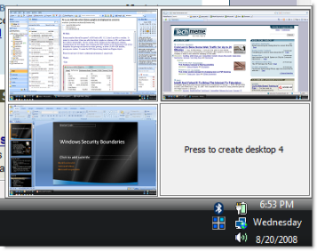

--- 
TOCTitle: Desktops
title: Desktops
description: This utility enables you to create up to four virtual desktops and easily switch between them.
ms:assetid: 'a6144f44-1b00-4308-94c0-6bf6e6a1aaee'
ms:mtpsurl: 'https://technet.microsoft.com/Cc817881(v=MSDN.10)'
ms.date: 10/12/2021
---

# Desktops v2.01

**By Mark Russinovich**

Published: October 12, 2021

 [**Download Desktops**](https://download.sysinternals.com/files/Desktops.zip) **(61 KB)**  
**Run now** from [Sysinternals Live](https://live.sysinternals.com/Desktops.exe).

## Introduction

Desktops allows you to organize your applications on up to four virtual
desktops. Read email on one, browse the web on the second, and do work
in your productivity software on the third, without the clutter of the
windows you're not using. After you configure hotkeys for switching
desktops, you can create and switch desktops either by clicking on the
tray icon to open a desktop preview and switching window, or by using
the hotkeys.

## Using Desktops

Unlike other virtual desktop utilities that implement their desktops by
showing the windows that are active on a desktop and hiding the rest,
Sysinternals Desktops uses a Windows desktop object for each desktop.
Application windows are bound to a desktop object when they are created,
so Windows maintains the connection between windows and desktops and
knows which ones to show when you switch a desktop. That making
Sysinternals Desktops very lightweight and free from bugs that the other
approach is prone to where their view of active windows becomes
inconsistent with the visible windows.

Desktops reliance on Windows desktop objects means that it cannot
provide some of the functionality of other virtual desktop utilities,
however. For example, Windows doesn't provide a way to move a window
from one desktop object to another, and because a separate Explorer
process must run on each desktop to provide a taskbar and start menu,
most tray applications are only visible on the first desktop. Further,
there is no way to delete a desktop object, so Desktops does not provide
a way to close a desktop, because that would result in orphaned windows
and processes. The recommended way to exit Desktops is therefore to
logoff.  

## Screenshot

  
Configuration Dialog

  
Tray Desktop Switch Window

 [**Download Desktops**](https://download.sysinternals.com/files/Desktops.zip) **(61 KB)**

**Run now** from [Sysinternals Live](https://live.sysinternals.com/Desktops.exe).

**Runs on:**

- Client: Windows Vista and higher.
- Server: Windows Server 2008 and higher.
