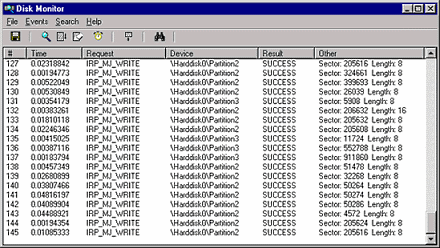

--- 
TOCTitle: DiskMon
title: DiskMon for Windows
description: This utility captures all hard disk activity or acts like a software disk activity light in your system tray.
ms:assetid: 'f9e26786-be46-4276-a073-8764d4e9fba4'
ms:mtpsurl: 'https://technet.microsoft.com/Bb896646(v=MSDN.10)'
ms.date: 11/01/2006
---

# DiskMon for Windows v2.01

**By Mark Russinovich**

Published: November 1, 2006

 [**Download Diskmon**](https://download.sysinternals.com/files/DiskMon.zip) **(80 KB)**  
**Run now** from [Sysinternals Live](https://live.sysinternals.com/Diskmon.exe).

## Introduction

*DiskMon* is an application that logs and displays all hard disk
activity on a Windows system. You can also minimize *DiskMon* to your
system tray where it acts as a disk light, presenting a green icon when
there is disk-read activity and a red icon when there is disk-write
activity.

## Installation and Use

Installing *DiskMon* is as easy as unzipping it and typing, "diskmon."
The menus and toolbar buttons can be used to disable event capturing,
control the scrolling of the listview, and to save the listview contents
to an ASCII file.

To have *DiskMon* function as a disk light in your system tray, select
the Options|Minimize to Tray menu item, or start *DiskMon* with a "/l"
(lower-case L) command-line switch e.g. diskmon /l. To reactivate the
*DiskMon* window double-click on the *DiskMon* tray icon. To create a
shortcut to Diskmon in the tray create a shortcut in your Program
Files\\Startup folder, edit the properties of the shortcut and set the
Target to point at the executable with the path in quotations and the
switch outside the quotes:

"C:\\Sysinternals Tools\\Diskmon.exe" /l

Read and write offsets are presented in terms of sectors (512 bytes).
Events can be either timed for their duration (in microseconds), or
stamped with the absolute time that they were initiated. The History
Depth dialog can be used to specify the maximum number of records that
will be kept in the GUI (0 signifies no limit).

## Implementation

*DiskMon* uses kernel event tracing. Event tracing is documented in the
Microsoft Platform SDK and the SDK contains source code to TraceDmp, on
which *DiskMon* is based.

 [**Download Diskmon**](https://download.sysinternals.com/files/DiskMon.zip) **(80 KB)** 

**Run now** from [Sysinternals Live](https://live.sysinternals.com/Diskmon.exe).
