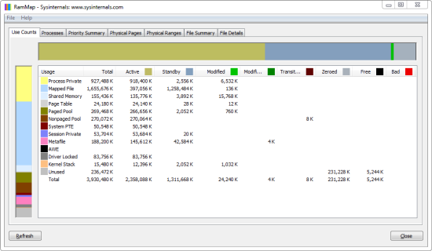

--- 
TOCTitle: RAMMap
title: RAMMap
description: An advanced physical memory usage analysis utility that presents usage information in different ways on its several different tabs.
ms:assetid: 'e90bb927-b735-4888-bedc-588efd5fd7eb'
ms:mtpsurl: 'https://technet.microsoft.com/Ff700229(v=MSDN.10)'
ms.date: 02/04/2026
---

# RAMMap v1.62

**By Mark Russinovich**

Published: February 4, 2026

 [**Download RAMMap**](https://download.sysinternals.com/files/RAMMap.zip) **(706 KB)**  
**Run now** from [Sysinternals Live](https://live.sysinternals.com/RAMMap.exe).

Have you ever wondered exactly how Windows is assigning physical memory,
how much file data is cached in RAM, or how much RAM is used by the
kernel and device drivers? RAMMap makes answering those questions easy.
RAMMap is an advanced physical memory usage analysis utility for Windows
Vista and higher. It presents usage information in different ways on its
several different tabs:

- *Use Counts:* usage summary by type and paging list
- *Processes:* process working set sizes
- *Priority Summary:* prioritized standby list sizes
- *Physical Pages:* per-page use for all physical memory
- *Physical Ranges:* physical memory addresses
- *File Summary:* file data in RAM by file
- *File Details:* individual physical pages by file

Use RAMMap to gain understanding of the way Windows manages memory, to
analyze application memory usage, or to answer specific questions about
how RAM is being allocated. RAMMap’s refresh feature enables you to
update the display and it includes support for saving and loading memory
snapshots.

For definitions of the labels RAMMap uses as well as to learn about the
physical-memory allocation algorithms used by the Windows memory
manager, please see [Windows Internals, 5^th^
Edition](~/resources/windows-internals.md).

## Related Links

- [**Windows Internals Book**](~/resources/windows-internals.md) The official updates and errata page for the definitive book on
    Windows internals, by Mark Russinovich and David Solomon.
- [**Windows Sysinternals Administrator's Reference**](~/resources/troubleshooting-book.md)The
    official guide to the Sysinternals utilities by Mark Russinovich and
    Aaron Margosis, including descriptions of all the tools, their
    features, how to use them for troubleshooting, and example
    real-world cases of their use.

 [**Download RAMMap**](https://download.sysinternals.com/files/RAMMap.zip) **(706 KB)**

**Run now** from [Sysinternals Live](https://live.sysinternals.com/RAMMap.exe).

**Runs on:**

- Client: Windows Vista and higher.
- Server: Windows Server 2008 and higher.

## Learn More

- [Defrag Tools: \#6 -  RAMMap](/shows/defrag-tools/6-rammap)  
    In this episode of Defrag Tools, Andrew Richards and Larry Larsen
    cover using RAMMap to see how RAM is being used and tell if there
    has been any memory pressure.
