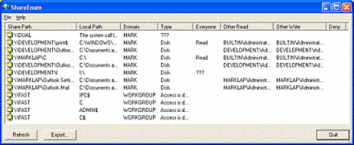

--- 
TOCTitle: ShareEnum
title: ShareEnum
description: Scan file shares on your network and view their security settings to close security holes.
ms:assetid: '03257fd3-88a5-44f8-8447-2d0055930c47'
ms:mtpsurl: 'https://technet.microsoft.com/Bb897442(v=MSDN.10)'
ms.date: 11/01/2006
---

# ShareEnum v1.6

**By Mark Russinovich**

Published: November 1, 2006

 [**Download ShareEnum**](https://download.sysinternals.com/files/ShareEnum.zip) **(94 KB)**  
**Run now** from [Sysinternals Live](https://live.sysinternals.com/ShareEnum.exe).

## Introduction

An aspect of Windows NT/2000/XP network security that's often overlooked
is file shares. A common security flaw occurs when users define file
shares with lax security, allowing unauthorized users to see sensitive
files. There are no built-in tools to list shares viewable on a network
and their security settings, but *ShareEnum* fills the void and allows
you to lock down file shares in your network.

When you run *ShareEnum* it uses NetBIOS enumeration to scan all the
computers within the domains accessible to it, showing file and print
shares and their security settings. Because only a domain administrator
has the ability to view all network resources, *ShareEnum* is most
effective when you run it from a domain administrator account.

  

## How It Works

ShareEnum uses **WNetEnumResource** to enumerate domains and the
computers within them and **NetShareEnum** to enumerate shares on
computers.

 [**Download ShareEnum**](https://download.sysinternals.com/files/ShareEnum.zip) **(94 KB)**

**Run now** from [Sysinternals Live](https://live.sysinternals.com/ShareEnum.exe).

**Runs on:**

- Client: Windows Vista and higher.
- Server: Windows Server 2008 and higher.
