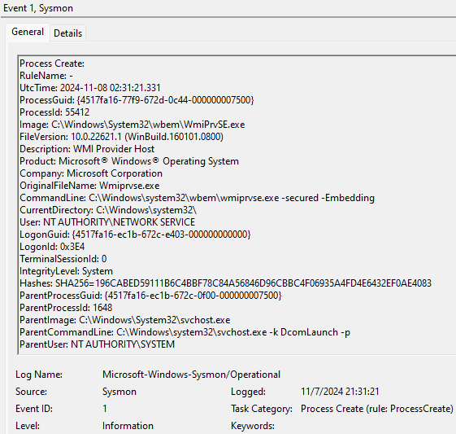

--- 
TOCTitle: Sysmon
title: Sysmon
description: Monitors and reports key system activity via the Windows event log.
no-loc: [Mark Russinovich, Thomas Garnier]
ms:assetid: 'f49b1cb3-c689-469e-ade0-6fa98d72f9d6'
ms:mtpsurl: 'https://technet.microsoft.com/Dn798348(v=MSDN.10)'
ms.date: 10/26/2022
---

# Sysmon v14.11

**By Mark Russinovich and Thomas Garnier**

Published: October 26, 2022

[](https://download.sysinternals.com/files/Sysmon.zip) [**Download Sysmon**](https://download.sysinternals.com/files/Sysmon.zip) **(4.6 MB)**

[**Download Sysmon for Linux (GitHub)**](https://github.com/Sysinternals/SysmonForLinux)

## Introduction

*System Monitor* (*Sysmon*) is a Windows system service and device
driver that, once installed on a system, remains resident across system
reboots to monitor and log system activity to the Windows event log. It
provides detailed information about process creations, network
connections, and changes to file creation time. By collecting the events
it generates using
[Windows Event Collection](https://msdn.microsoft.com/library/windows/desktop/bb427443(v=vs.85).aspx)
or
[SIEM](https://en.wikipedia.org/wiki/security_information_and_event_management)
agents and subsequently analyzing them, you can identify malicious or
anomalous activity and understand how intruders and malware operate on
your network.

Note that *Sysmon* does not provide analysis of the events it generates,
nor does it attempt to protect or hide itself from attackers.

## Overview of Sysmon Capabilities

*Sysmon* includes the following capabilities:

- Logs process creation with full command line for both current and
    parent processes.
- Records the hash of process image files using SHA1 (the default),
    MD5, SHA256 or IMPHASH.
- Multiple hashes can be used at the same time.
- Includes a process GUID in process create events to allow for
    correlation of events even when Windows reuses process IDs.
- Includes a session GUID in each event to allow correlation of events
    on same logon session.
- Logs loading of drivers or DLLs with their signatures and hashes.
- Logs opens for raw read access of disks and volumes.
- Optionally logs network connections, including each connection’s
    source process, IP addresses, port numbers, hostnames and port
    names.
- Detects changes in file creation time to understand when a file was
    really created. Modification of file create timestamps is a
    technique commonly used by malware to cover its tracks.
- Automatically reload configuration if changed in the registry.
- Rule filtering to include or exclude certain events dynamically.
- Generates events from early in the boot process to capture activity
    made by even sophisticated kernel-mode malware.

## Screenshots



## Usage

Common usage featuring simple command-line options to install and uninstall
Sysmon, as well as to check and modify its configuration:

Install:                 `sysmon64 -i [<configfile>]`  
Update configuration:    `sysmon64 -c [<configfile>]`  
Install event manifest:  `sysmon64 -m`  
Print schema:            `sysmon64 -s`  
Uninstall:               `sysmon64 -u [force]`  

|Parameter  |Description  |
|---------|---------|
|  **-i** |  Install service and driver. Optionally take a configuration file.|
|  **-c** |  Update configuration of an installed Sysmon driver or dump the current configuration if no other argument is provided. Optionally takes a configuration file.|
|  **-m** |  Install the event manifest (implicitly done on service install as well).|
|  **-s** |  Print configuration schema definition.|
|  **-u** |  Uninstall service and driver. Using `-u force` causes uninstall to proceed even when some components are not installed.|

The service logs events immediately and the driver installs as a
boot-start driver to capture activity from early in the boot that the
service will write to the event log when it starts.

On Vista and higher, events are stored in `Applications and Services
Logs/Microsoft/Windows/Sysmon/Operational`.
On older systems, events are written to the `System` event log.

If you need more information on configuration files, use the `-? config`
command.

Specify `-accepteula` to automatically accept the EULA on installation,
otherwise you will be interactively prompted to accept it.

Neither install nor uninstall requires a reboot.

## Examples

Install with default settings (process images hashed with SHA1 and no
network monitoring)

```cmd
sysmon -accepteula -i
```

Install Sysmon with a configuration file (as described below)

```cmd
sysmon -accepteula -i c:\windows\config.xml
```

Uninstall

```cmd
sysmon -u
```

Dump the current configuration

```cmd
sysmon -c
```

Reconfigure an active Sysmon with a configuration file (as described below)

```cmd
sysmon -c c:\windows\config.xml
```

Change the configuration to default settings

```cmd
sysmon -c --
```

Show the configuration schema

```cmd
sysmon -s
```

## Events

On Vista and higher, events are stored in `Applications and Services
Logs/Microsoft/Windows/Sysmon/Operational`, and on older systems events
are written to the System event log. Event timestamps are in UTC
standard time.

The following are examples of each event type that Sysmon generates.

### Event ID 1: Process creation

The process creation event provides extended information about a newly
created process. The full command line provides context on the process
execution. The ProcessGUID field is a unique value for this process
across a domain to make event correlation easier. The hash is a full
hash of the file with the algorithms in the HashType field.

### Event ID 2: A process changed a file creation time

The change file creation time event is registered when a file creation
time is explicitly modified by a process. This event helps tracking the
real creation time of a file. Attackers may change the file creation
time of a backdoor to make it look like it was installed with the
operating system. Note that many processes legitimately change the
creation time of a file; it does not necessarily indicate malicious
activity.

### Event ID 3: Network connection

The network connection event logs TCP/UDP connections on the machine. It
is disabled by default. Each connection is linked to a process through
the ProcessId and ProcessGUID fields. The event also contains the source
and destination host names IP addresses, port numbers and IPv6 status.

### Event ID 4: Sysmon service state changed

The service state change event reports the state of the Sysmon service
(started or stopped).

### Event ID 5: Process terminated

The process terminate event reports when a process terminates. It
provides the UtcTime, ProcessGuid and ProcessId of the process.

### Event ID 6: Driver loaded

The driver loaded events provides information about a driver being
loaded on the system. The configured hashes are provided as well as
signature information. The signature is created asynchronously for
performance reasons and indicates if the file was removed after loading.

### Event ID 7: Image loaded

The image loaded event logs when a module is loaded in a specific
process. This event is disabled by default and needs to be configured
with the –l option. It indicates the process in which the module is
loaded, hashes and signature information. The signature is created
asynchronously for performance reasons and indicates if the file was
removed after loading. This event should be configured carefully, as
monitoring all image load events will generate a large number of events.

### Event ID 8: CreateRemoteThread

The CreateRemoteThread event detects when a process creates a thread in
another process. This technique is used by malware to inject code and
hide in other processes. The event indicates the source and target
process. It gives information on the code that will be run in the new
thread: StartAddress, StartModule and StartFunction. Note that
StartModule and StartFunction fields are inferred, they might be empty
if the starting address is outside loaded modules or known exported
functions.

### Event ID 9: RawAccessRead

The RawAccessRead event detects when a process conducts reading
operations from the drive using the `\\.\` denotation. This technique
is often used by malware for data exfiltration of files that are locked
for reading, as well as to avoid file access auditing tools. The event
indicates the source process and target device.

### Event ID 10: ProcessAccess

The process accessed event reports when a process opens another process,
an operation that’s often followed by information queries or reading and
writing the address space of the target process. This enables detection
of hacking tools that read the memory contents of processes like Local
Security Authority (Lsass.exe) in order to steal credentials for use in
Pass-the-Hash attacks. Enabling it can generate significant amounts of
logging if there are diagnostic utilities active that repeatedly open
processes to query their state, so it generally should only be done so
with filters that remove expected accesses.

### Event ID 11: FileCreate

File create operations are logged when a file is created or overwritten.
This event is useful for monitoring autostart locations, like the
Startup folder, as well as temporary and download directories, which are
common places malware drops during initial infection.

### Event ID 12: RegistryEvent (Object create and delete)

Registry key and value create and delete operations map to this event
type, which can be useful for monitoring for changes to Registry
autostart locations, or specific malware registry modifications.

Sysmon uses abbreviated versions of Registry root key names, with the
following mappings:

|Key name  | Abbreviation  |
|---------|---------|
|  `HKEY_LOCAL_MACHINE`                         | `HKLM` |
|  `HKEY_USERS`                                  | `HKU` |
|  `HKEY_LOCAL_MACHINE\System\ControlSet00x`  | `HKLM\System\CurrentControlSet` |
|  `HKEY_LOCAL_MACHINE\Classes`                | `HKCR` |

### Event ID 13: RegistryEvent (Value Set)

This Registry event type identifies Registry value modifications. The
event records the value written for Registry values of type DWORD and
QWORD.

### Event ID 14: RegistryEvent (Key and Value Rename)

Registry key and value rename operations map to this event type,
recording the new name of the key or value that was renamed.

### Event ID 15: FileCreateStreamHash

This event logs when a named file stream is created, and it generates
events that log the hash of the contents of the file to which the stream
is assigned (the unnamed stream), as well as the contents of the named
stream. There are malware variants that drop their executables or
configuration settings via browser downloads, and this event is aimed at
capturing that based on the browser attaching a `Zone.Identifier` "mark of
the web" stream.

### Event ID 16: ServiceConfigurationChange

This event logs changes in the Sysmon configuration - for example when the
filtering rules are updated.

### Event ID 17: PipeEvent (Pipe Created)

This event generates when a named pipe is created. Malware often uses named
pipes for interprocess communication.

### Event ID 18: PipeEvent (Pipe Connected)

This event logs when a named pipe connection is made between a client and a
server.

### Event ID 19: WmiEvent (WmiEventFilter activity detected)

When a WMI event filter is registered, which is a method used by malware to
execute, this event logs the WMI namespace, filter name and filter expression.

### Event ID 20: WmiEvent (WmiEventConsumer activity detected)

This event logs the registration of WMI consumers, recording the consumer name,
log, and destination.

### Event ID 21: WmiEvent (WmiEventConsumerToFilter activity detected)

When a consumer binds to a filter, this event logs the consumer name and filter path.

### Event ID 22: DNSEvent (DNS query)

This event is generated when a process executes a DNS query, whether the result is successful or fails, cached or not.
The telemetry for this event was added for Windows 8.1 so it is not available on Windows 7 and earlier.

### Event ID 23: FileDelete (File Delete archived)

A file was deleted. Additionally to logging the event, the deleted file is also
saved in the `ArchiveDirectory` (which is `C:\Sysmon` by default). Under normal
operating conditions this directory might grow to an unreasonable size - see
event ID 26: `FileDeleteDetected` for similar behavior but without saving the
deleted files.

### Event ID 24: ClipboardChange (New content in the clipboard)

This event is generated when the system clipboard contents change.

### Event ID 25: ProcessTampering (Process image change)

This event is generated when process hiding techniques such as "hollow" or
"herpaderp" are being detected.

### Event ID 26: FileDeleteDetected (File Delete logged)

A file was deleted.

### Event ID 27: FileBlockExecutable

This event is generated when Sysmon detects and blocks the creation of executable files.

### Event ID 28: FileBlockShredding

This event is generated when Sysmon detects and blocks file shredding from tools such as [SDelete](sdelete.md).

### Event ID 255: Error

This event is generated when an error occurred within Sysmon. They can
happen if the system is under heavy load and certain tasked could not be
performed or a bug exists in the Sysmon service. You can report any bugs
on the Sysinternals forum or over Twitter
([@markrussinovich](https://twitter.com/markrussinovich)).

## Configuration files

Configuration files can be specified after the **-i** (installation) or
**-c** (installation) configuration switches. They make it easier to
deploy a preset configuration and to filter captured events.

A simple configuration xml file looks like this:

```xml
<Sysmon schemaversion="4.82">
  <!-- Capture all hashes -->
  <HashAlgorithms>*</HashAlgorithms>
  <EventFiltering>
    <!-- Log all drivers except if the signature -->
    <!-- contains Microsoft or Windows -->
    <DriverLoad onmatch="exclude">
      <Signature condition="contains">microsoft</Signature>
      <Signature condition="contains">windows</Signature>
    </DriverLoad>
    <!-- Do not log process termination -->
    <ProcessTerminate onmatch="include" />
    <!-- Log network connection if the destination port equal 443 -->
    <!-- or 80, and process isn't InternetExplorer -->
    <NetworkConnect onmatch="include">
      <DestinationPort>443</DestinationPort>
      <DestinationPort>80</DestinationPort>
    </NetworkConnect>
    <NetworkConnect onmatch="exclude">
      <Image condition="end with">iexplore.exe</Image>
    </NetworkConnect>
  </EventFiltering>
</Sysmon>
```

The configuration file contains a schemaversion attribute on the Sysmon
tag. This version is independent from the Sysmon binary version and
allows the parsing of older configuration files. You can get the current
schema version by using the “-? config” command line. Configuration
entries are directly under the Sysmon tag and filters are under the
EventFiltering tag.

## Configuration Entries

Configuration entries are similar to command line switches and include the following

Configuration entries include the following:

|  Entry             |   Value  |  Description|
|--------------------|----------|-------------|
| ArchiveDirectory   |  String  | Name of directories at volume roots into which copy-on-delete                                  files are moved. The directory is protected with a System ACL (you can use PsExec from Sysinternals to access the directory                                 using `psexec -sid cmd`). Default: Sysmon |
| CheckRevocation   |  Boolean | Controls signature revocation checks. Default: True |
|  CopyOnDeletePE   |  Boolean | Preserves deleted executable image files. Default: False |
|  CopyOnDeleteSIDs | Strings  | Comma-separated list of account SIDs for which file deletes will be preserved. |
|  CopyOnDeleteExtensions | Strings  | Extensions for files that are preserved on delete. |
|  CopyOnDeleteProcesses  | Strings | Process name(s) for which file deletes will be preserved. |
|  DnsLookup     |   Boolean | Controls reverse DNS lookup. Default: True |
|  DriverName    |   String  | Uses specied name for driver and service images.  |
| HashAlgorithms |   Strings  | Hash algorithm(s) to apply for hashing. Algorithms supported include MD5, SHA1, SHA256, IMPHASH and * (all). Default: None |

Command line switches have their configuration entry described in the Sysmon usage
output. Parameters are optional based on the tag. If a command line
switch also enables an event, it needs to be configured though its
filter tag. You can specify the -s switch to have Sysmon print the full
configuration schema, including event tags as well as the field names
and types for each event. For example, here’s the schema for the
`RawAccessRead` event type:

```xml
<event name="SYSMON_RAWACCESS_READ" value="9" level="Informational "template="RawAccessRead detected" rulename="RawAccessRead" version="2">  
  <data name="UtcTime" inType="win:UnicodeString" outType="xs:string"/>  
  <data name="ProcessGuid" inType="win:GUID"/>  
  <data name="ProcessId" inType="win:UInt32" outType="win:PID"/>  
  <data name="Image" inType="win:UnicodeString" outType="xs:string"/>  
  <data name="Device" inType="win:UnicodeString" outType="xs:string"/>  
</event>  
```

## Event filtering entries

Event filtering allows you to filter generated events. In many cases
events can be noisy and gathering everything is not possible. For
example, you might be interested in network connections only for a
certain process, but not all of them. You can filter the output on the
host reducing the data to collect.

Each event has its own filter tag under the EventFiltering node in a
configuration file:

|ID  |Tag  | Event |
|---------|---------|---------|
|  **1**    ProcessCreate         | Process Create |
|  **2**    FileCreateTime        | File creation time |
|  **3**    NetworkConnect        | Network connection detected |
|  **4**    n/a                   | Sysmon service state change (cannot be filtered) |
|  **5**    ProcessTerminate      | Process terminated |
|  **6**    DriverLoad            | Driver Loaded |
|  **7**    ImageLoad             | Image loaded |
|  **8**    CreateRemoteThread    | CreateRemoteThread detected |
|  **9**    RawAccessRead         | RawAccessRead detected |
|  **10**   ProcessAccess         | Process accessed |
|  **11**   FileCreate            | File created |
|  **12**   RegistryEvent         | Registry object added or deleted |
|  **13**   RegistryEvent         | Registry value set |
|  **14**   RegistryEvent         | Registry object renamed |
|  **15**   FileCreateStreamHash  | File stream created |
|  **16**   n/a                   | Sysmon configuration change (cannot be filtered) |
|  **17**   PipeEvent             | Named pipe created |
|  **18**   PipeEvent             | Named pipe connected |
|  **19**   WmiEvent              | WMI filter |
|  **20**   WmiEvent              | WMI consumer |
|  **21**   WmiEvent              | WMI consumer filter |
|  **22**   DNSQuery              | DNS query |
|  **23**   FileDelete            | File Delete archived |
|  **24**   ClipboardChange       | New content in the clipboard |
|  **25**   ProcessTampering      | Process image change |
|  **26**   FileDeleteDetected    | File Delete logged |
|  **27**   FileBlockExecutable   | File Block Executable |
|  **28**   FileBlockShredding    | File Block Shredding |

You can also find these tags in the event viewer on the task name.

The `onmatch` filter is applied if events are matched. It can be changed
with the `onmatch` attribute for the filter tag. If the value is
`"include"`, it means only matched events are included. If it is set to
`"exclude"`, the event will be included except if a rule match. You can
specify both an include filter set and an exclude filter set for each
event ID, where exclude matches take precedence.

Each filter can include zero or more rules. Each tag under the filter
tag is a field name from the event. Rules that specify a condition for
the same field name behave as OR conditions, and ones that specify
different field name behave as AND conditions. Field rules can also use
conditions to match a value. The conditions are as follows (all are case
insensitive):

|  **Condition**   | **Description** |
|---------|---------|
|  **is**          | Default, values are equals |
|  **is any**      | The field is one of the `;` delimited values |
|  **is not**      | Values are different |
|  **contains**    | The field contains this value |
|  **contains any**  | The field contains any of the `;` delimited values |
|  **contains all** | The field contains all of the `;` delimited values |
|  **excludes**    | The field does not contain this value |
|  **excludes any**  |The field does not contain one or more of the `;` delimited values |
|  **excludes all** |The field does not contain any of the `;` delimited values |
|  **begin with**  | The field begins with this value |
|  **end with**    | The field ends with this value |
|  **not begin with**  | The field does not begin with this value |
|  **not end with**    | The field does not end with this value |
|  **less than**   | Lexicographical comparison is less than zero |
|  **more than**   | Lexicographical comparison is more than zero |
|  **image**       | Match an image path (full path or only image name). For example: `lsass.exe` will match `c:\windows\system32\lsass.exe` |

You can use a different condition by specifying it as an attribute. This
excludes network activity from processes with iexplore.exe in their
path:

```xml
<NetworkConnect onmatch="exclude">
  <Image condition="contains">iexplore.exe</Image>
</NetworkConnect>
```

To have Sysmon report which rule match resulted in an event being logged, add
names to rules:

```xml
<NetworkConnect onmatch="exclude">
  <Image name="network iexplore" condition="contains">iexplore.exe</Image>
</NetworkConnect>
```

You can use both include and exclude rules for the same tag, where exclude rules
override include rules. Within a rule, filter conditions have OR behavior.

In the sample configuration shown earlier, the networking filter uses both an
include and exclude rule to capture activity to port 80 and 443 by all processes
except those that have `iexplore.exe` in their name.

It is also possible to override the way that rules are combined by using a rule
group which allows the rule combine type for one or more events to be set
explicity to AND or OR.

The following example demonstrates this usage. In the first rule group, a
process create event will be generated when `timeout.exe` is executed only with
a command line argument of `100`, but a process terminate event will be
generated for the termination of `ping.exe` and `timeout.exe`.

```xml
  <EventFiltering>
    <RuleGroup name="group 1" groupRelation="and">
      <ProcessCreate onmatch="include">
        <Image condition="contains">timeout.exe</Image>
        <CommandLine condition="contains">100</CommandLine>
      </ProcessCreate>
    </RuleGroup>
    <RuleGroup groupRelation="or">
      <ProcessTerminate onmatch="include">
        <Image condition="contains">timeout.exe</Image>
        <Image condition="contains">ping.exe</Image>
      </ProcessTerminate>        
    </RuleGroup>
    <ImageLoad onmatch="include"/>
  </EventFiltering>
```

[](https://download.sysinternals.com/files/Sysmon.zip) [**Download Sysmon**](https://download.sysinternals.com/files/Sysmon.zip) **(4.6 MB)**
  
**Runs on:**

- Client: Windows 8.1 and higher.
- Server: Windows Server 2012 and higher.
