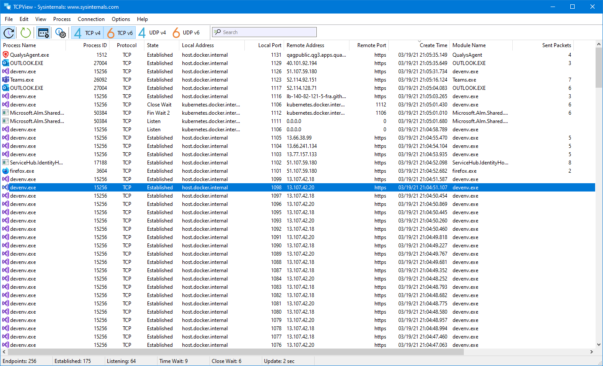

# TCPView v4.19

**By Mark Russinovich**

Published: April 11, 2023

[](https://download.sysinternals.com/files/TCPView.zip) [**Download TCPView**](https://download.sysinternals.com/files/TCPView.zip) **(1.5 MB)**  
**Run now** from [Sysinternals Live](https://live.sysinternals.com/Tcpview.exe).

## Introduction

TCPView is a Windows program that will show you detailed listings of all
TCP and UDP endpoints on your system, including the local and remote
addresses and state of TCP connections. On Windows Server 2008, Vista,
and XP, TCPView also reports the name of the process that owns the
endpoint. TCPView provides a more informative and conveniently presented
subset of the Netstat program that ships with Windows. The TCPView
download includes Tcpvcon, a command-line version with the same
functionality.



## Using TCPView

When you start TCPView it will enumerate all active TCP and UDP
endpoints, resolving all IP addresses to their domain name versions. You
can use a toolbar button or menu item to toggle the display of resolved
names. TCPView shows the name of the process that owns each endpoint, including the service name (if any).

By default, TCPView updates every second, but you can use the
**Options|Refresh Rate** menu item to change the rate. Endpoints that
change state from one update to the next are highlighted in yellow;
those that are deleted are shown in red, and new endpoints are shown in
green.

You can close established TCP/IP connections (those labeled with a state
of ESTABLISHED) by selecting **File|Close Connections**, or by
right-clicking on a connection and choosing **Close Connections** from
the resulting context menu.

You can save TCPView's output window to a file using the **Save** menu
item.

## Using Tcpvcon

Tcpvcon usage is similar to that of the built-in Windows netstat
utility:

**Usage:**

```Shell
tcpvcon [-a] [-c] [-n] [process name or PID]
```

|Parameter  |Description  |
|---------|---------|
|  **-a**  | Show all endpoints (default is to show established TCP connections).|
|  **-c**  | Print output as CSV.|
|  **-n**  | Don't resolve addresses.|

[](https://download.sysinternals.com/files/TCPView.zip) [**Download TCPView**](https://download.sysinternals.com/files/TCPView.zip) **(1.5 MB)**

**Run now** from [Sysinternals Live](https://live.sysinternals.com/Tcpview.exe).

**Runs on:**

- Client: Windows 8.1 and higher.
- Server: Windows Server 2012 and higher.
