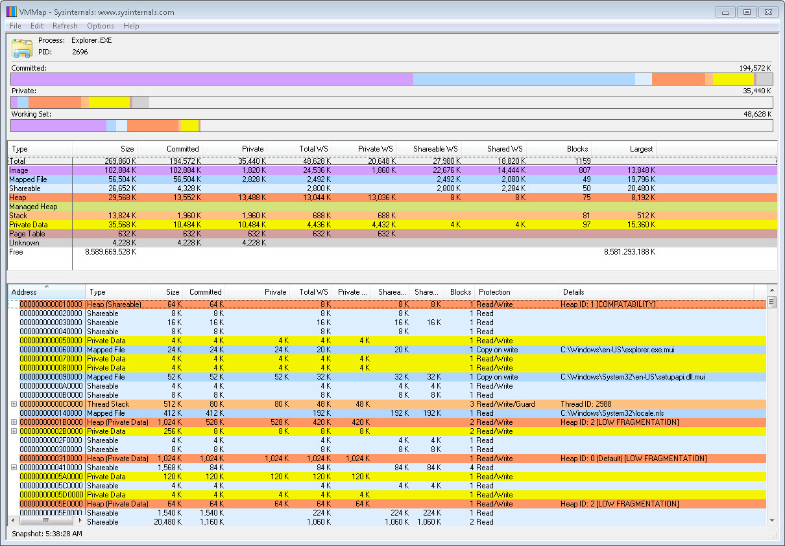

--- 
TOCTitle: VMMap
title: VMMap
description: VMMap is a process virtual and physical memory analysis utility.
no-loc: [Mark Russinovich, David Solomon, Andrew Richards, Larry Larsen, Aaron Margosis]
ms:assetid: '0b5217b3-99e1-4742-b502-7574bb478a16'
ms:mtpsurl: 'https://technet.microsoft.com/Dd535533(v=MSDN.10)'
ms.date: 01/27/2022
---

# VMMap v3.32

**By Mark Russinovich**

Published: January 27, 2022

 [**Download VMMap**](https://download.sysinternals.com/files/VMMap.zip)  **(1.3 MB)**  
**Run now** from [Sysinternals Live](https://live.sysinternals.com/vmmap.exe).

## Introduction

VMMap is a process virtual and physical memory analysis utility. It
shows a breakdown of a process's committed virtual memory types as well
as the amount of physical memory (working set) assigned by the operating
system to those types. Besides graphical representations of memory
usage, VMMap also shows summary information and a detailed process
memory map. Powerful filtering and refresh capabilities allow you to
identify the sources of process memory usage and the memory cost of
application features.

Besides flexible views for analyzing live processes, VMMap supports the
export of data in multiple forms, including a native format that
preserves all the information so that you can load back in. It also
includes command-line options that enable scripting scenarios.

VMMap is the ideal tool for developers wanting to understand and
optimize their application's memory resource usage.

## Screenshot

## Related Links

- [**Windows Internals Book**](~/resources/windows-internals.md)  
    The official updates and errata page for the definitive book on
    Windows internals, by Mark Russinovich and David Solomon.
- [**Windows Sysinternals Administrator's Reference**](~/resources/troubleshooting-book.md)
    The official guide to the Sysinternals utilities by Mark Russinovich and
    Aaron Margosis, including descriptions of all the tools, their
    features, how to use them for troubleshooting, and example
    real-world cases of their use.

 [**Download VMMap**](https://download.sysinternals.com/files/VMMap.zip)  **(1.3 MB)**

**Run now** from [Sysinternals Live](https://live.sysinternals.com/vmmap.exe).

**Runs on:**

- Client: Windows Vista and higher.
- Server: Windows Server 2008 and higher.

## Getting Help

If you have problems or questions, please visit the [Sysinternals
Forum](https://forum.sysinternals.com).  

## Learn More

- [Defrag Tools: \#7 -
    VMMap](/shows/defrag-tools/live-build-2014)  
    In this episode of Defrag Tools, Andrew Richards and Larry Larsen
    cover how to use VMMap to see how Virtual Memory is being used and
    if there have been any memory leaks.
