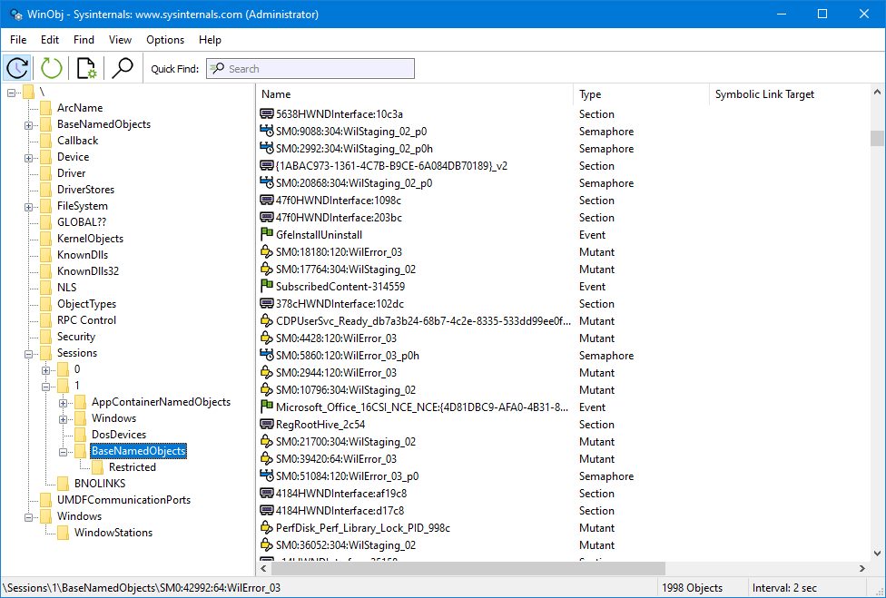

# WinObj v3.02

**By Mark Russinovich**

Published: March 23, 2021

 [**Download WinObj**](https://download.sysinternals.com/files/WinObj.zip) **(1.4 MB)**  
**Run now** from [Sysinternals Live](https://live.sysinternals.com/Winobj.exe).

## Introduction

*WinObj* is a must-have tool if you are a system administrator concerned
about security, a developer tracking down object-related problems, or
just curious about the Object Manager namespace.

*WinObj* is a 32-bit Windows NT program that uses the native Windows NT
API (provided by NTDLL.DLL) to access and display information on the NT
Object Manager's namespace. Winobj may seem similar to the Microsoft
SDK's program of the same name, but the SDK version suffers from
numerous significant bugs that prevent it from displaying accurate
information (e.g. its handle and reference counting information are
totally broken). In addition, our WinObj understands many more object
types. Finally, Version 3.0 of our WinObj has user-interface
enhancements (including a dark theme), knows how to open device objects, provides dynamic updates when objects are created/destroyed, and allows searching and filtering.

## Installation and Use

There is no device driver component to WinObj, so you can run it like
any Win32 program.

## How it Works

The Object Manager is in charge of managing NT objects. As part of this
responsibility, it maintains an internal namespace where various
operating system components, device drivers and Win32 programs can store
and lookup objects. The native NT API provides routines that allow
user-mode programs to browse the namespace and query the status of
objects located there, but the interfaces are undocumented.

## More Information

Helen Custer's *Inside Windows NT* provides a good overview of the
Object Manager name space, and Mark's October 1997 [WindowsITPro
Magazine](https://www.windowsitpro.com/) column, "Inside the Object
Manager", is (of course) an excellent overview.

 [**Download WinObj**](https://download.sysinternals.com/files/WinObj.zip) **(1.4 MB)**  
**Run now** from [Sysinternals Live](https://live.sysinternals.com/Winobj.exe).

**Runs on:**

- Client: Windows Vista and higher.
- Server: Windows Server 2008 and higher.
