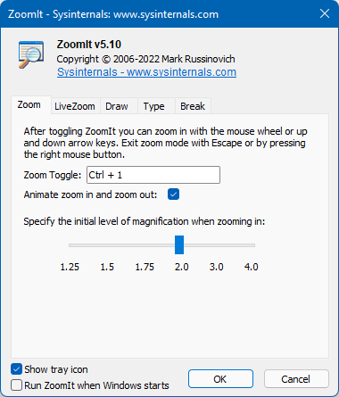

--- 
TOCTitle: ZoomIt
title: ZoomIt
description: Presentation utility for zooming and drawing on the screen.
no-loc: [Mark Russinovich]
ms:assetid: '0b6c4abc-9482-4759-a9cd-bf77cb961dd4'
ms:mtpsurl: 'https://technet.microsoft.com/Bb897434(v=MSDN.10)'
ms.date: 07/19/2022
---

# ZoomIt v6.0

**By Mark Russinovich**

Published: July 19, 2022

 [**Download ZoomIt**](https://download.sysinternals.com/files/ZoomIt.zip) **(977 KB)**  
**Run now** from [Sysinternals Live](https://live.sysinternals.com/ZoomIt.exe).

## Introduction

ZoomIt is a screen zoom and annotation tool for technical presentations
that include application demonstrations. ZoomIt runs unobtrusively in
the tray and activates with customizable hotkeys to zoom in on an area
of the screen, move around while zoomed, and draw on the zoomed image. I
wrote ZoomIt to fit my specific needs and use it in all my
presentations.

ZoomIt works on all versions of Windows and you can use pen input for
ZoomIt drawing on tablet PCs.  

## Using ZoomIt

The first time you run ZoomIt it presents a configuration dialog that
describes ZoomIt's behavior, let's you specify alternate hotkeys for
zooming and for entering drawing mode without zooming, and customize the
drawing pen color and size. I use the draw-without-zoom option to
annotate the screen at its native resolution, for example. ZoomIt also
includes a break timer feature that remains active even when you tab
away from the timer window and allows you to return to the timer window
by clicking on the ZoomIt tray icon.  
  
### Shortcuts

ZoomIt offers a number of shortcuts which can extend its usage greatly.

|  Function | Shortcut  |
|---|---|
| Zoom Mode | Ctrl + 1 |
| Zoom In | Mouse Scroll Up or Up Arrow |
| Zoom Out | Mouse Scroll Down or Down Arrow |
| Start Drawing (While In Zoom Mode) | Left-Click  |
| Stop Drawing (While In Zoom Mode) | Right-Click  |
| Start Drawing (While Not In Zoom Mode) | Ctrl + 2  |
| Increase/Decrease Line And Cursor Size (Drawing Mode) | Ctrl + Mouse Scroll Up/Down or Arrow Keys |
| Center The Cursor (Drawing Mode) | Space Bar |
| Whiteboard (Drawing Mode) | W |
| Blackboard (Drawing Mode) | K |
| Type in Text | T |
| Increase/Decrease Font Size (Typing Mode) | Ctrl + Mouse Scroll Up/Down or Arrow Keys |
| Red Pen | R |
| Green Pen | G |
| Blue Pen | B |
| Yellow Pen | Y |
| Orange Pen | O |
| Pink Pen | P |
| Draw a Straight Line | Hold Shift |
| Draw a Rectangle | Hold Ctrl |
| Draw an Ellipse | Hold Tab |
| Draw an Arrow | Hold Ctrl + Shift |
| Erase Last Drawing | Ctrl + Z |
| Erase All Drawings | E |
| Copy Screenshot to Clipboard | Ctrl + C |
| Save Screenshot as PNG | Ctrl + S |
| Start/Stop Screen Recording Saved as MP4 (Windows 10 May 2019 Update And Higher) | Ctrl + R |
| Show Countdown Timer | Ctrl + 3 |
| Increase/Decrease Time | Ctrl + Mouse Scroll Up/Down or Arrow Keys |
| Minimize Timer (Without Pausing It) | Alt + Tab |
| Show Timer When Minimized | Left-Click On The ZoomIt Icon |
| Live Zoom Mode | Ctrl + 4 |
| Exit | Esc or Right-Click |

  

 [**Download ZoomIt**](https://download.sysinternals.com/files/ZoomIt.zip) **(977 KB)**  
**Run now** from [Sysinternals Live](https://live.sysinternals.com/ZoomIt.exe).
