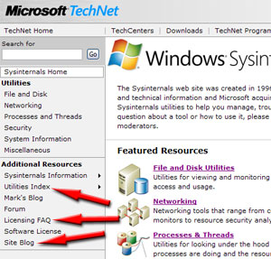
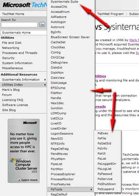

[[Newsletters Archive ^]](index.md) [[< Volume 8, Number 2]](v08n02migration.md) [[Volume 8, Number 4 >]](v08n04procmon.md)

# New! Sysinternals TechCenter

## Utility Update Details

### Announcing Process Monitor v1.0

We’re excited to announce the release of Process Monitor, a system monitoring tool that not only replaces Regmon and Filemon by including file system and registry monitoring, but adds process, thread, and DLL monitoring as well as advanced filtering, event information, and basic data mining capabilities.

### DebugView v4.63

This DebugView update supports Windows Vista, including Windows Vista 64-bit for x64.

### Streams v1.53

Streams v1.53 includes a minor security change in the way that it opens files that allows it to access more files.

### Filemon v7.04, Regmon v7.04

These updates reflect minor bug fixes.

### PsTools v2.4

PsShutdown includes a bug fix for the –t switch (revved to 2.51) and PsGetSid no longer uses a service to query the local system SID.

### Autoruns v8.54

This release fixes bugs in path parsing and 32-bit path resolution on 64-bit systems and adds support for Local Security Authority security providers.

### Process Explorer v10.21

This Process Explorer release fixes a bug in 32-bit path resolution on 64-bit systems and changes the threads tab to asynchronously populate its thread list.

### Ctrl2cap

Ctrl2cap now works on 64-bit Windows Vista for x64.

## Site Update Highlights:

Hello and welcome to the new Sysinternals TechCenter. We hope you'll find this new format as convenient as the previous Sysinternals site (http<nolink>://www.microsoft.com/technet/sysinternals/default.mspx)

We are nearly finished migrating all the content over to this new site (we’re still moving a couple Information pages). During the first few weeks of this new site, we will be monitoring an e-mail alias dedicated to troubleshooting site issues you may encounter. If you cannot find something or run into a problem with the site, please don't hesitate to contact us at syssite at microsoft dot com. Thank you for your patience during this migration process.

We hope you’ll be pleased with some couple new features that we’ve added to this TechCenter. Our primary goal is to help you find the right tools and navigate to the desired information as quickly as possible. They are as follows:

1. A powerful new complete index of all the Utilities. Now all the tools are just one click away (notice the new ‘hover menus’).

2. In addition, we’ve added a single download that contains all the utilities call the ‘Sysinternals Suite’.

3. In order to summarize the changes we’ve made to the licensing terms, a Licensing FAQ page has been created.

Published Monday, November 06, 2006 3:33 PM by ottoh

[[Newsletters Archive ^]](index.md) [[< Volume 8, Number 2]](v08n02migration.md) [[Volume 8, Number 4 >]](v08n04procmon.md)
